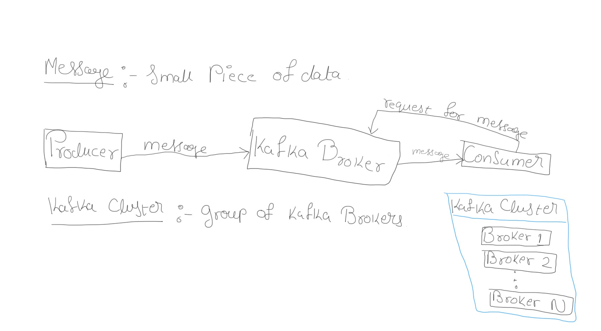
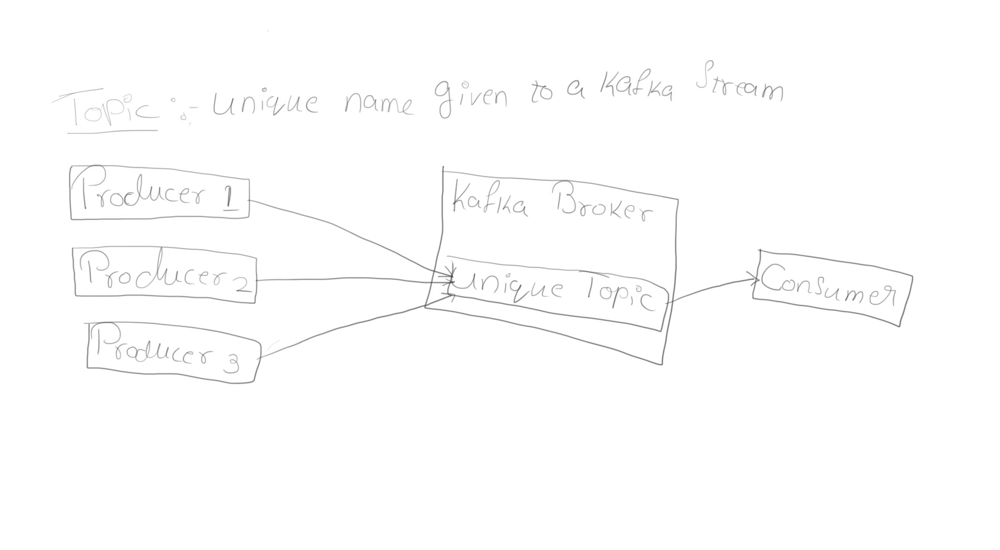
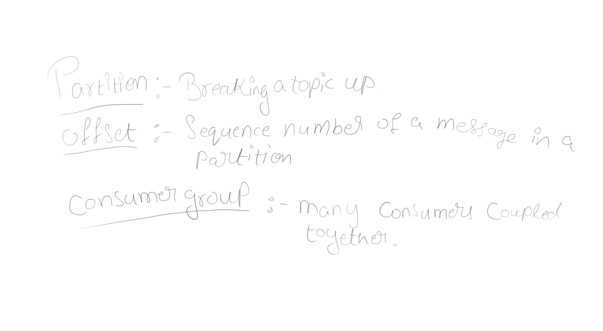

<h1>Kafka Basics</h1>

<h1> Programing In Kafka using Java </h1>
Followed this tutorial to set up basic intellij to use kafka and maven.
https://www.javatpoint.com/creating-kafka-producer-in-java
 
Use this tutorial to start zookeeper and kafka broker.
https://www.youtube.com/watch?v=6AYNxdKQ_0o&list=PLkz1SCf5iB4enAR00Z46JwY9GGkaS2NON&index=6
